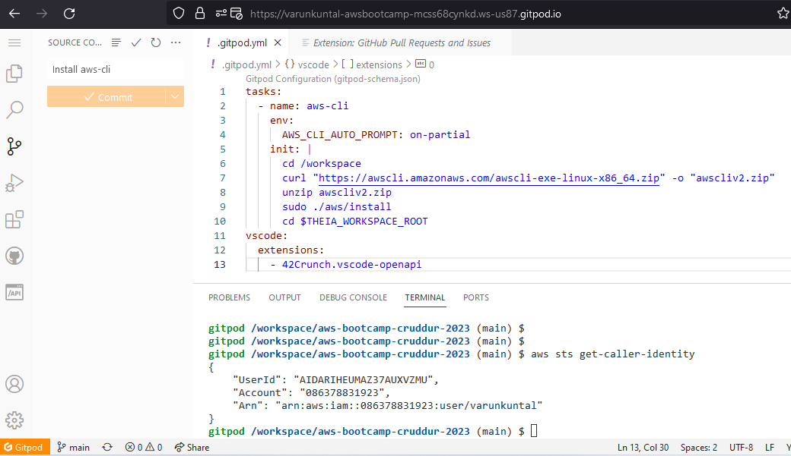
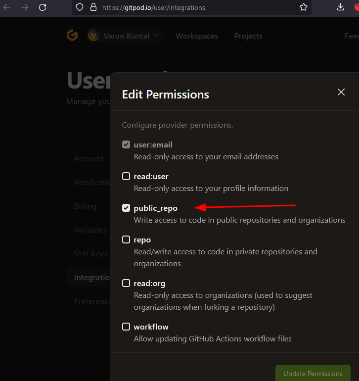
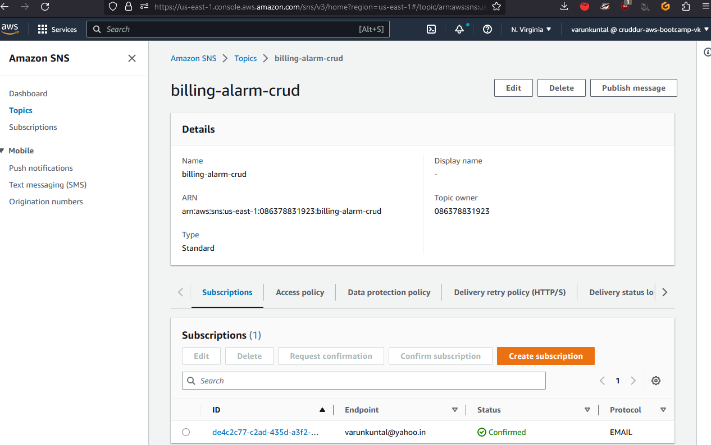

# Week 0 — Billing and Architecture

## Required Homework/Tasks

### Install and Verify AWS CLI 

Configured Gitpod environment to install aws cli everytime new environment is provisioned.

To push code from Gitpod to Github, configure permission in Gitpod integrations to allow it to push code to repo.

### Create Budget

For demonstration purpose, created a $1 Budget & notification with subscribers.

### SNS Topic subscription confirmation

Using an email id, confirmed the SNS subscription.

### Logical Architecture Diagram Recreation

[Lucid.app Commentable Link](https://lucid.app/lucidchart/e154493c-c29f-41ce-9115-52e6c5cdcf0d/edit?viewport_loc=-660%2C-736%2C2170%2C2660%2C0_0&invitationId=inv_320ccf60-b95c-4980-ae7b-8de775f06b3e)

Having watched live stream video on 11th, and the videos thereafter, it became clear how to record homework.

### Watched [**Spend Considerations**](https://www.youtube.com/watch?v=OVw3RrlP-sI) video, here is a list of points video informs about:

- Video starts with introduction to tracking the free tier usage and how to see where your AWS bill will be.
- Pricing varies according to the region where services were spun up.
- Billing page displays the services which are running or stopped grouped according to the type of service & the region in which they were provisioned.
- Under Free tier we can visualize usage of free tier services and the forecasted usages.
- Billing alert system is discussed and its management. It also provides an overview of the budget system.
- Threshold value is set to trigger alert.
- Cost allocation tags can help filter resources to separate them logically.
- It also mentions how amazon cost calculator takes 730 hours into account during estimation instead of 720 or 733 for a month.
- Then it explains how to calculate the cost of different AWS services. It also provides a cost explorer for tracking and calculating AWS costs.
- Finally it explains different tier types for free AWS services which include 12 Months Free, Always Free & Trials. It is encouraged to terminate unused services as they may incur charges.

### Watched [**Security Considerations**](https://www.youtube.com/watch?v=4EMWBYVggQI) video, here is list of points to consider when starting with cloud implementations:

- Cloud security is the process of protecting data in applications and systems hosted in the cloud, as opposed to traditional cyber security measures which focus on protecting data in on-premises environments.
- Ashish shows how to add an MFA route to a root user in IAM. This is a prerequisite for some later tasks in the course.
- The video discusses how to create an AWS organization unit and accounts within it, and how to use them to manage policies, security, and costs. It recommends that the management account should not have any applications, and that the organization unit should be used to create individual business units.
- In this tutorial, Ashish covers how to create an AWS organization, and how to manage and use AWS accounts within that organization. He also demonstrates how to move an active AWS account into the desired organization unit.
- CloudTrail is a service that AWS provides for recording all API calls in your AWS account. This allows you to understand the activity taking place in your AWS account and to monitor whether your data is in the right place.
- This video discusses how to enable AWS cloudtrail, which records all activity on an AWS account. Cloudtrail can be enabled at the organization level, and data and insights can be monitored.
- In this video, Cloud BootCamp instructor explains how to create IAM users in Amazon Web Services. First, he reviews the three types of users in AWS: users like you and me, system users, and federated users. Next, he explains how to create an IAM user. Finally, he demonstrates how to use the user's access permissions to access a system.
- In this video, Cloud BootCamp student and beginning AWS user Dylan teaches how to create users, manage their passwords, and set up IAM policies for controlling access to the AWS account.
- In this video, Cloud BootCamp instructor explains how to create IAM rules. Rules allow you to control access to AWS services and resources. You can create a custom role, or use an existing role, to grant permissions to a user or group. Finally, you add a tag to the role to identify it.
- In this video, Cloud BootCamp instructor discusses the basics of AWS organizations, IAM, and policy. He shows how to create and attach a policy to a user, group, or service. This video is useful for beginners who want to understand the basics of AWS governance.
- This YouTube video explains how to create and apply service control policies (SCPs) in AWS. The video also provides an example policy that prevents users from leaving an organization.
- This video covers the basics of creating and applying AWS IAM policies. The main points covered include setting up a policy, attaching a policy to an account, and deleting a policy. Additionally, the video discusses the difference between Global and Regional IAM policies, and provides an example of how to use IAM for compliance.

