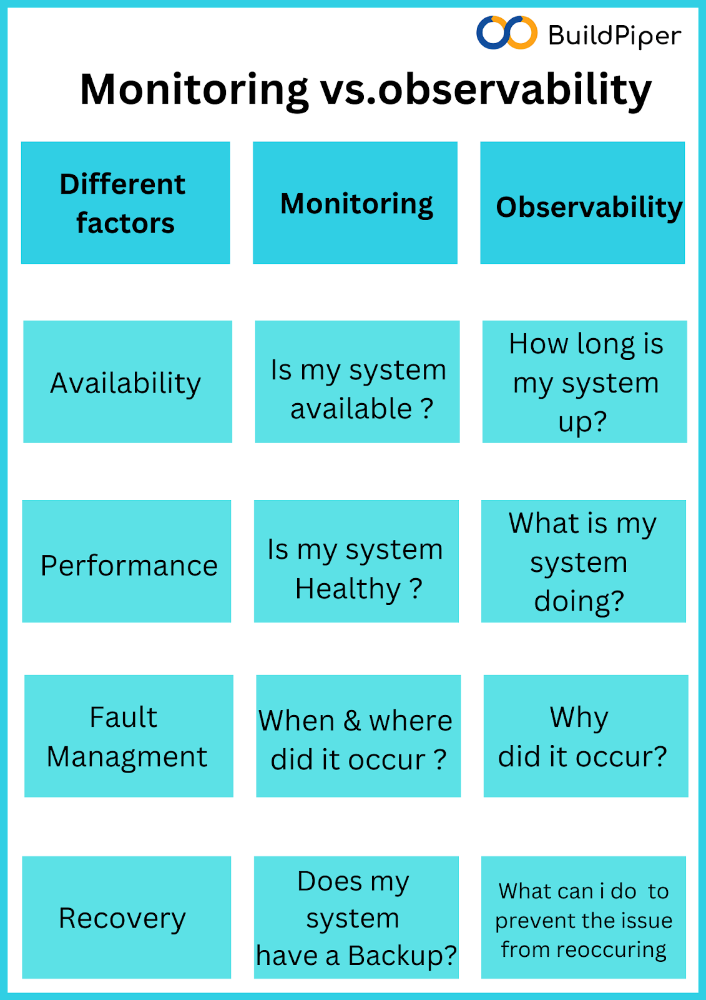
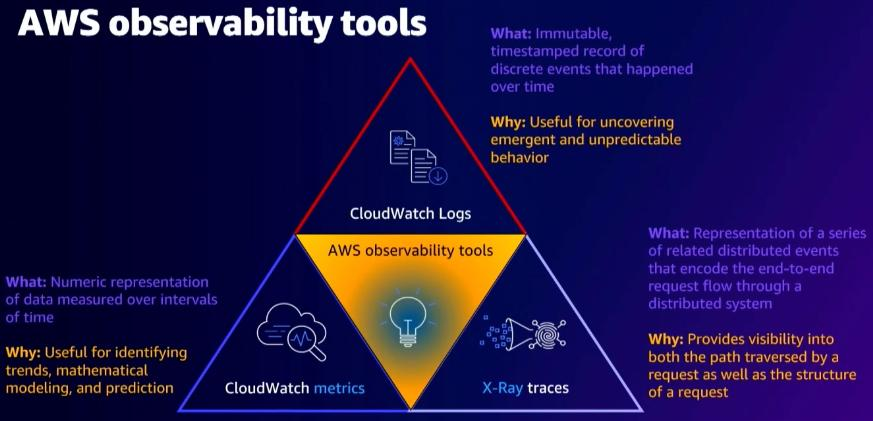
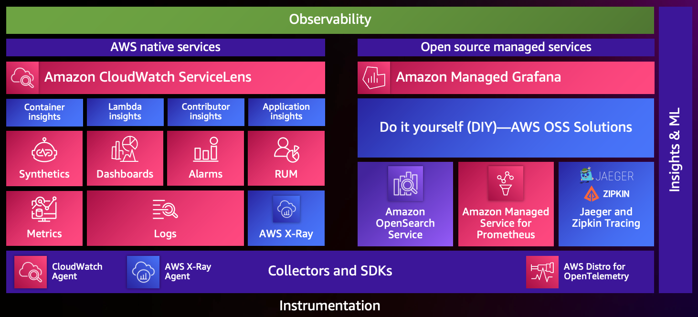

# Week 2 — Distributed Tracing

## Week 2 Live stream notes with timestamps:

### Timestamps:
`00:00 Introduction`

	- 00:42 AWS Ontario Virtual User Group
	- 01:42 Sponsors (Adrian Cantrill, WeCloudData, AWS)
	- 03:19 AWS User Groups Global
	- 03:34 Schedule
	- 03:43 Read the Instructions
	- 04:00 Guest Instructor Jessica Kerr & Student Advocate Shala Warner
	
`04:45 Programs & Softwares, Debugger & Observability, Logs vs Observability, Story by Logs is Tracing`

`08:45 Example of a Trace (Backend sequential queries on mysql through duration graph)`

`12:47 Service Map Honeycomb`

`14:00 Instrumentation (Code that sends data to make Trace)`

`15:33 Student Homework, Discord, Using Tags, Captioning unavilable in Youtube`

`21:28 Gitpod using week-2-again branch`

`23:44 Honeycomb.io Login`

	- 25:09 Environments
	- 27:16 Export Honeycomb API key Environment
	- 29:45 Set Service Name
	
`30:24 Hardcoding OTEL (Open Telemetry) service name env in docker compose for indivudual service`

`33:41 OpenTelemetry open source by CNCF, configurable, open standard of observability platform`

`37:29 Exporting env variables works for current shell tab and not accross parallel shell tabs`

`39:19 Instrumentation instructions`

`41:21 Step 1- Requirements.txt `

`45:04 Step 2- Initializer, OpenTelemetry for Python, Setting Env variables`

`51:52 Step 3- Configure & Run, Instrument Honeycomb`

`56:13 Why npm install is manually done when Dockerfile does it`

`57:00 Never use same Dockerfile in production & development`

`59:36 Staging vs Production Envirnment`

`1:00:05 Docker compose is up`

`1:01:23 Ports unlocked by default using gitpod.yml`

`1:04:00 Making API calls for Honeycomb to collect data, Debugging why data was not received, logging spans`

`1:09:40 Suggestion: Docker compose overwrites it with volume, getting spans after hitting endpoint`

`1:10:45 Resolution: Environment variables, API key not matching with ENV variable in container as it was copied from instructions`

`1:12:00 honeycomb-whoami.glitch.me to find out information about an API key like Team, Environment & permissions`

`1:14:30 honeycomb test env, setting correct API key env variable`

`1:20:29 Trace for single span, /api/activities/home`

`1:22:50 Hardcoding a span`

`1:23:30 backend_flask services > home_activities.py, tracer name home.activities`

`1:30:59 Fields & values in span, library name -> opentelemtry.instrumentation.flask`

`1:31:50 Adding attribute to span, make spans replacement for logs, creating custom span attributes`

`1:37:21 Honeycomb ui New Query, visualize->count, group by->trace.trace_id`

`1:40:40 Visualize trace, where -> app.result_length exists, visualize -> MAX(app.result_length)`

`1:43:30 Feature and billing comparison with Datadog`

`1:45:30 P90, Heatmap of query, zooming duration`

`1:47:48 Reason for adding observability early on in course, Distributed Tracing as a valuable skill on Resume`

`1:51:01 Committing code for homework, tagging using git`

`1:53:40 Homework Challenges discussion, new challenges over what is already done`

## Spending Considerations:

- Honeycomb 20M request per month free tier
- Rollbar 5k request per month free with 30 Days retention
- AWS X RAY - 100K traces free
- Cloud Watch 3 Dashboards, 50 Metrics, 10 Alarms, 5GB Data ingestion - can be very expensive

## Security Considerations:
- Logging comes into picture when something goes wrong, like site doesn't come up.
- Depending upon the type of Cloud Service (Iaas, Paas or Saas) logging varies.
- Logging sucks! Time consuming, needle in haystack, not for quick finding / analysis
- Observability decresed alert fatigue. 
- Visibility of end2end logs, metrics & tracing.
- Troubleshoot & resolve quickly at low costs.
- Understand Health, accelerate collaboration between teams, 
- Reduce operational costs, increase customer satisfaction.

### Monitoring vs Observability

In monitoring, e.g. it refreshes every 5 second & lets us know that if service is down, like a puppy.
Problem is when application is complex, there is peripherals not seen like multiple applications to get log data,
Unless we dig deep into logs, we would not know why error occurred.

Observability shows entire lifecycle of problem which we want to identify.
What can we do to prevent issue form reoccurring.
We have visibility on every process running.
Break down an application into multiple proceeses & have an exact trace of where function is calling
where it is traversing data, what kind of metrics should you look for

### 3 Pillars of Observability:

- Logs: Every app produces logs
- Metrics: Improvement over logs, enhance the logs being produced, metrics are created from logs
- Traces: Trace back to exact pin point prolem that caused root problem.

### AWS Observability Tools:
- AWS CloudWatch Logs
- AWS CloudWatch Metrics
- AWS X Ray Traces

### Other AWS Services:

- CloudTrail
- CloudWatch Agent
- CloudWatch Metrics
- X Ray traces
- AWS Private CA
- AWS Certificate Manager
- AWS Backup
- Amazon Inspector
- AWS KMS
- AWS ECS Cluster auto scaling

### To enable these services, we need Instrumentation
Instrumentation helps create logs, traces, metrics

### Sending CloudTrail logs to CloudWatch
- Adding Cloud Watch Logs in CloudTrail AWS console after creating a new trail or using existing one.
- Enable Cloud Watch Logs - creates log group inside cloud watch, allows us to create metrics in cloud watch. We find log groups under logs.
- We create a new Cloud Watch Logs using existing IAM Role by giving **Log group name** & **Role Name**.
- Save Changes -> enables capability of cloud trail logs to start sending information to cloud watch.
- Good for 2 reasons. If a hacker deletes cloud trail, or disable logging into CloudWatch or if a novice user deletes CloudTrail.
- Metrics Filter using a pattern.
- If you have an ec2 instance running with amazon images, which comes with a cloud watch agent which can be enabled and allows us to create a log group, then we can create mertics for it. e.g. 
- 
1. If security group is changed, an alarm should be raised if security group is open to internet. 
2. Or if we create a storage bucket that is open to the internet.

- Threat Modelling Exersize: Identify potential attack paths which may lead to compromise e.g. fishing e-mail, DDOS, malware etc. 
- Refer to industry standards for techniques used by hackers.
- Attack MITRE reports popular techniques among hackers.
- Use it identify agents available for instrumentation. 
- For instrumentation perspective we have CloudWatch agent, AWS Security Hub, SIEM Solutions

Event Driven Security

- Event Driven Architecture using Serverless 
- Auto Remediation with Amazon EventBridge and AWS Security Hub 
- AWS Services for Threat Detection - Amazon Guard Duty,3rd Party etc

